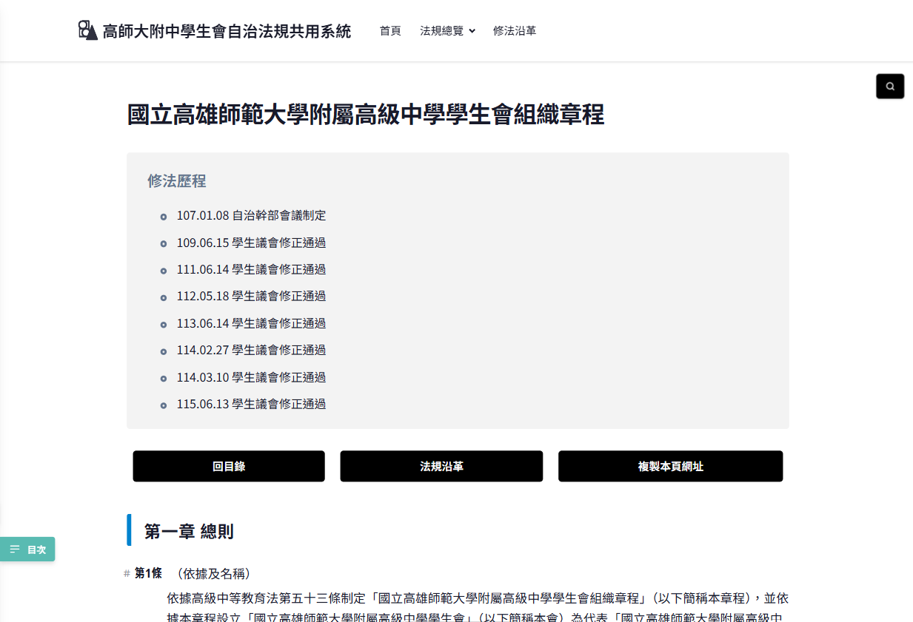
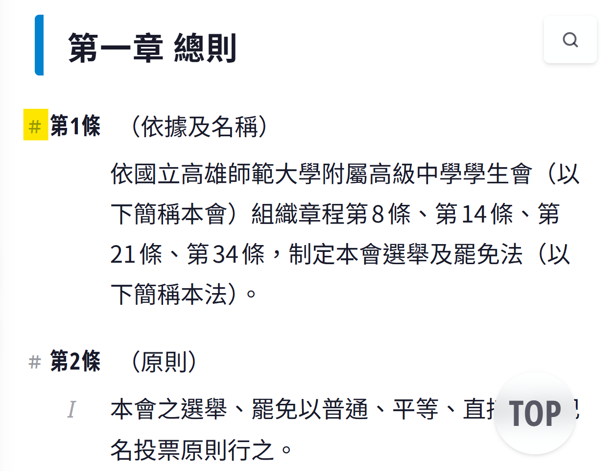
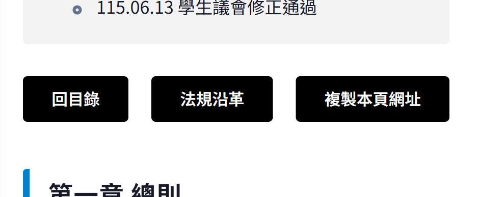
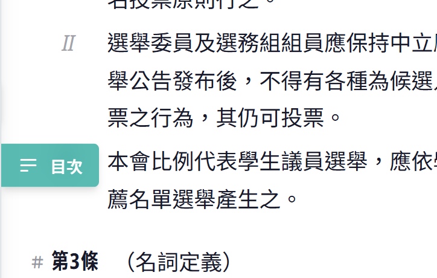
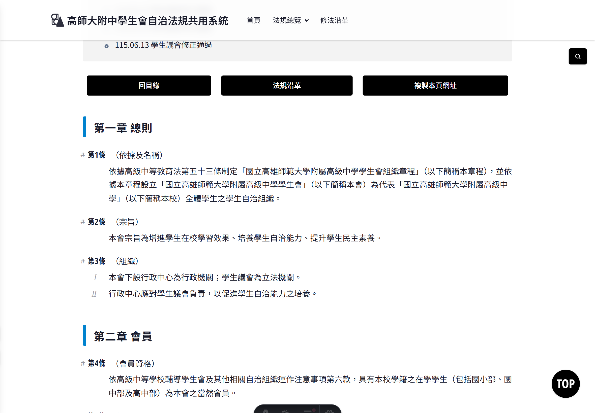

法規系統SA Law為了提升使用者體驗，附帶數種便利功能，本文詳細說明如下。

## 本頁目次 <!-- omit from toc -->

- [頁面內搜尋](#頁面內搜尋)
- [錨點連結](#錨點連結)
- [功能清單（搭配錨點）](#功能清單搭配錨點)
- [目次](#目次)
- [深色模式](#深色模式)
- [「項」加註羅馬數字](#項加註羅馬數字)
- [其他相關教學文章](#其他相關教學文章)

## 頁面內搜尋

使用方法：

1. 前往各法規（`/act`）、其修法沿革（`/amendments`）頁面。
2. 點擊右上角懸浮的「放大鏡」按鈕。
3. 輸入關鍵字查找。

需注意的是，頁面內查詢只會搜尋：

- 法條標題、內文
- 對照表標題、內文（不含總說明）

其餘內容如附件內文、跨法規查詢等，需自行查閱。

_右上角「放大鏡圖示」即為頁面內搜尋功能。_

## 錨點連結

各法規條號前方均有井字號「＃」，點擊「＃」會將畫面移動至該法條的位置，並使網址帶有該法條的錨點（點擊目次內的章節也會有相同的效果）。

此時只要點擊複製連結，或手動將連結複製下來，會發現網址後方有「`#article-X`」的錨點。您亦可手動修改錨點以快速導航至目標條號。

_點擊條號前方的井字號「＃」，即可移動至該條文的位置，此時複製連結就會帶有該條條文錨點。_

## 功能清單（搭配錨點）

各法條頁面均有三個功能選單，分別為`回法規目錄`、`法規沿革`以及`複製本頁網址`。

法規沿革部分，如導向本系統內的沿革頁面，則僅顯示為「`法規沿革`」；如導向外部資料（諸如校務章則之沿革），則會顯示為類似於「`法規沿革↗`」的樣態。

_各法規頁面提供三種功能選單，注意中間「法規沿革」按鈕為內部／外部網址。_

## 目次

分為行動版與電腦版的運作邏輯，分述如下：

1. 行動版操作邏輯

   於「畫面頂部及底部」，或是「向上滑動」時，會於左下方跳出目次按鈕，點擊即可開啟目次選單。

   點擊章節後目次選單會自動關閉；點擊上方`<`按鈕或右邊選單之外空白區域，亦可手動關閉目次。

2. 電腦版操作邏輯

   電腦版因螢幕較寬，有足夠側邊空間，因此目次會常駐在畫面左方。如不希望目次干擾閱讀體驗，亦可點擊上方`<`按鈕手動關閉目次。

_非常榮幸與各位介紹本系統最受歡迎的功能：條文目次！_

## 深色模式

法規系統會隨裝置偏好自動切換深色／淺色主題。

_深色／淺色模式自動隨裝置設定變化。_

## 「項」加註羅馬數字

<!-- NOTE: 或可獨立成篇？ -->

依照本會法規標準法的規定，「項」不冠數字。考量書寫上的美觀，學生議會排版「項」的時候，會於前方空二字書寫，惟於項數較多時，仍難快速辨別某項是該條中的第某項。

有鑑於此，參考我國法律實務方式，使用羅馬數字於項的前方加註項次，以方便對照。並參考中央法規資料庫的體例，條文中僅一項者，不另加註項次。

但引用法規文本時，除依本會自治法規標準法第6條之1[^1]書寫者之外，項仍應以阿拉伯數字寫為第1項、第2項為宜。

_參照我國法律實務做法，項加註羅馬數字。並僅於2項以上才開始加註數字。_

## 其他相關教學文章

- [教學：如何回報問題](/laws/blog/report-issue)
- [教學：如何安裝SA Law](/laws/blog/how-to-install)
- [教學：全站搜尋功能](/laws/blog/full-site-search)

[^1]: 本會自治法規標準法第6條之1內容請[見此](/laws/act/act07#article-6-1)。

<!-- === TODO ===
- [x] PWA
- [x] 頁面內搜尋
- [ ] ~~總附件選單（路徑：`https://ashssa.github.io/laws/act/appendix/`）~~
- [x] 實用：錨點連結
- [x] 目次（可收合）
- [x] 功能清單（1. 複製連結可包含錨點； 2. 直接連結至沿革資料夾很方便）
- [ ] 美感：主題功能（廢物）
- [x] 自動調整深色模式
- [ ] 各種按鈕的毛玻璃設計（移動到《設計理念文章》）
- [x] 法條條文格式的調整：項加上了羅馬數字方便閱讀

- ★ alt + C 可快速切換 TODO List 狀態 ★
-->
