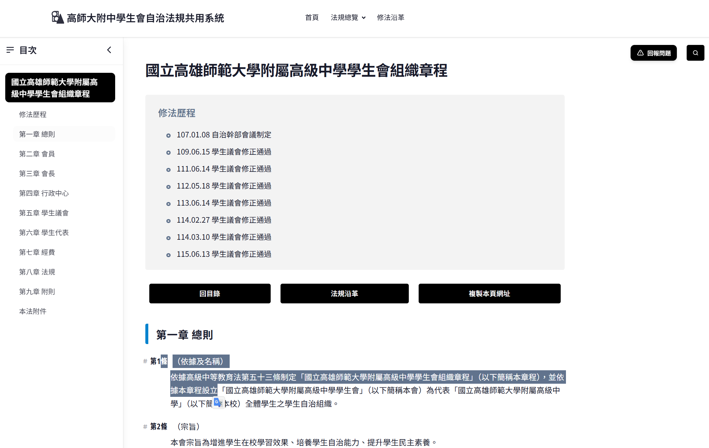
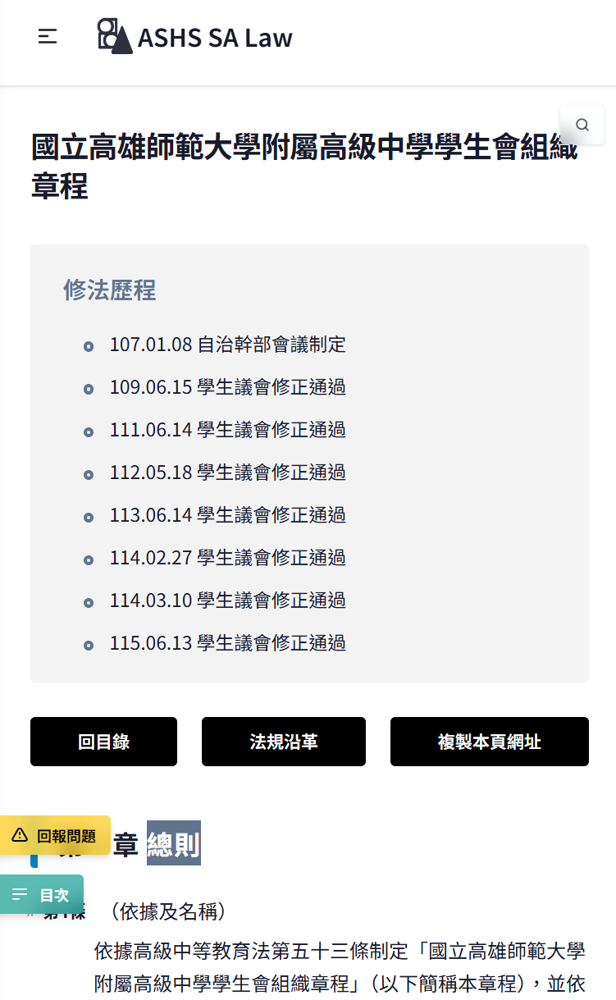

使用本系統閱覽各自治法規（`/act`）或其修法沿革（`/amendments`）時，如遇到問題，可以依使用設備類型使用下方所述的回報問題方式。

## 本文目次<!-- omit from toc -->

- [電腦版回報問題](#電腦版回報問題)
- [手機版（行動載具）回報問題](#手機版行動載具回報問題)
- [對於法規及沿革文本以外內容的問題回報方式](#對於法規及沿革文本以外內容的問題回報方式)
- [相關連結](#相關連結)

## 電腦版回報問題

1. 將遇到問題的文本框選起來。
2. 右上角搜尋按鈕的左方，會出現「回報問題」按鈕，點擊於「聯絡我們」頁面填入問題。
3. 系統會自動填入發現問題的地方，只需稍加描述問題即可送出。

_電腦版網站中，框選法規文字後，右上角即會出現「回報問題」按鈕_

## 手機版（行動載具）回報問題

1. 將遇到問題的文本框選起來。
2. 左下角或是目次的上方，會出現「回報問題」按鈕，點擊於「聯絡我們」頁面填入問題。
3. 系統會自動填入發現問題的地方，只需稍加描述問題即可送出。

_行動版網站中，框選法規文字後，左下角（目次按鈕的上方）會出現黃色的「回報問題」按鈕。_

## 對於法規及沿革文本以外內容的問題回報方式

如問題發生在法規文本以外之處，或是回報問題按鈕沒有如預期地出現，請將該頁面的網址或標題記下，往下滑動至本網頁最下方點擊「聯絡我們」按鈕，並於表單中描述發生的問題類型及狀況，我們將盡速修復。

## 相關連結

- [其他功能教學](/laws/blog/guide)
- [聯絡我們頁面](/laws/information/contact-us)
